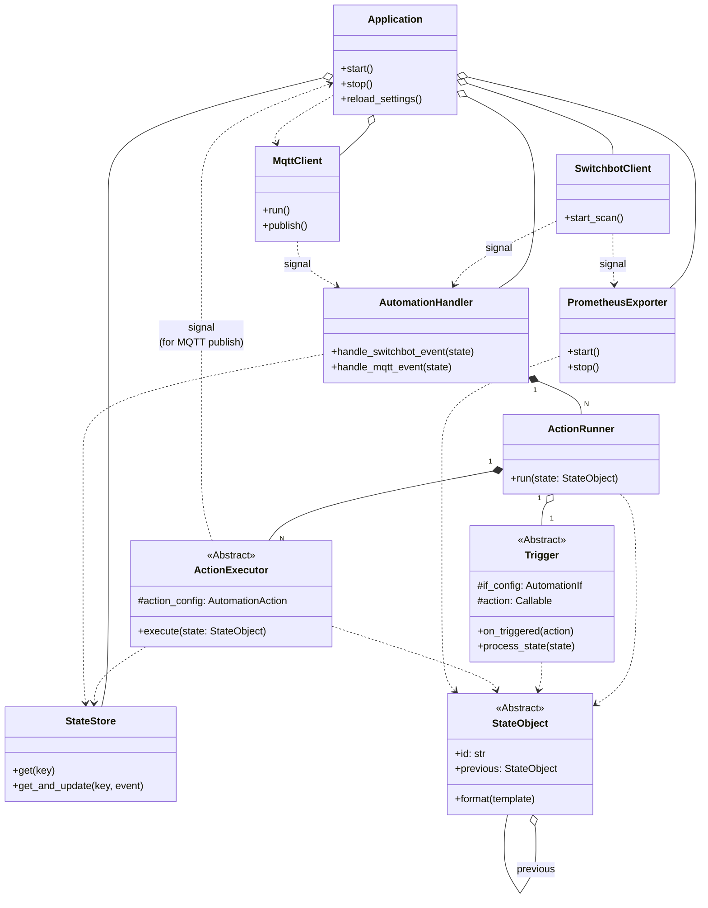

# Project Specification: switchbot-actions

## 1. Overview

This document outlines the design for `switchbot-actions`, a Python application designed to monitor SwitchBot Bluetooth Low Energy (BLE) devices and other event sources. The project has two primary goals:

1.  **Prometheus Exporter**: To expose sensor and state data from SwitchBot devices as metrics that can be scraped by a Prometheus server.
2.  **Automation Engine**: To provide a unified mechanism for executing custom actions based on a flexible `if/then` rule structure defined in the `automations` section of a configuration file.

## 2. Architecture

The application employs a decoupled, signal-based architecture. The `SwitchbotClient` component is responsible for scanning advertisements. For each new advertisement, it emits a `switchbot_advertisement_received` signal. The `MqttClient` component connects to an MQTT broker and listens for messages, emitting an `mqtt_message_received` signal for each message.

These signals are consumed by the `AutomationHandler`, which acts as a central dispatcher. Upon initialization, it reads the automation rules from the configuration and, based on the `source` field of each rule, instantiates the appropriate `ActionRunner` subclass (e.g., `EventActionRunner` or `TimerActionRunner`).

Each `ActionRunner` instance encapsulates the logic for its trigger type, including condition evaluation, cooldown management, and action execution. When an action is triggered, it delegates the execution to the `action_executor` module, which handles the specifics of running shell commands, webhooks, etc.

The core of the condition evaluation logic is encapsulated within the StateObject class, defined in the evaluator module. When the AutomationHandler receives a raw event (e.g., from SwitchbotClient or MqttClient), it uses a factory function (create_state_object_with_previous) to wrap the event in a corresponding StateObject subclass (e.g., SwitchBotState), along with its previous state. This unified StateObject is then passed to the appropriate ActionRunner, which uses the object's methods to check conditions and format action parameters, making the system extensible to new event sources.

### Class Diagram



## 3. Components

### 3.1. `SwitchbotClient`

  - **Responsibility**: Continuously scans for SwitchBot BLE advertisements and serves as the central publisher of device events.
  - **Functionality**: Emits a `switchbot_advertisement_received` signal with the new state object as its payload.

### 3.2. `MqttClient`

  - **Responsibility**: Manages the connection to the MQTT broker, including automatic reconnection, and handles message publishing and subscribing.
  - **Functionality**: Emits an `mqtt_message_received` signal for incoming messages and provides a `publish` method for actions.

### 3.3. `StateStore`

  - **Responsibility**: Acts as an in-memory cache for the latest known state of every observed entity. It is the single source of truth for the current state.
  - **Functionality**: Provides atomic operations for retrieving and updating state using `get` and `get_and_update` methods, ensuring data consistency in asynchronous environments.

### 3.4. `PrometheusExporter`

  - **Responsibility**: Exposes device states from `StateStore` as Prometheus metrics.
  - **Functionality**: Starts an HTTP server. When scraped, it fetches the latest data for all entities and formats it into Prometheus metrics.

### 3.5. `state` (Module)

  - **Responsibility**: Encapsulates event data and its associated logic into a unified `StateObject` interface. This abstracts away the differences between various event sources (e.g., SwitchBot vs. MQTT).
  - **Functionality**:
      - **`StateObject` (Abstract Class)**: The core abstraction that defines the common interface for all state events. It provides methods like `.id` to get a unique identifier and `.format(template)` to populate placeholders in actions.
      - **`SwitchBotState` & `MqttState` (Concrete Classes)**: Implement the `StateObject` interface for SwitchBot BLE advertisements and MQTT messages, respectively.
      - **`create_state_object_with_previous` (Factory Function)**: A factory that takes a new raw event and its preceding raw event, then returns the appropriate, fully initialized `StateObject` instance with its historical context.

### 3.6. `ActionExecutor` (Abstract Class) and its Subclasses

  - **Responsibility**: Defines a common interface for executing all types of actions and encapsulates the specific logic for each one.
  - **Functionality**: The abstract `ActionExecutor` class declares an `execute` method. Concrete subclasses like `ShellCommandExecutor`, `WebhookExecutor`, and `SwitchBotCommandExecutor` implement this method to perform their specific tasks. This design allows the `ActionRunner` to treat all actions uniformly.

### 3.7. `AutomationHandler`

  - **Responsibility**: Acts as the central dispatcher for automation rules. It receives signals and delegates processing to the appropriate `ActionRunner`.
  - **Functionality**: Initializes `ActionRunner` instances based on the automation configurations and calls their `run` method when a relevant signal is received.

### 3.8. `Trigger` (Abstract Class) and its Subclasses

  - **Responsibility**: Defines *when* an action should be triggered based on state changes. This component encapsulates the core triggering logic, separating it from the action execution flow.
  - **`EdgeTrigger`**:
    - **Functionality**: Triggers actions when the conditions transition from `False` to `True` (a rising edge). This is used for event-driven sources like `source: "switchbot"` and `source: "mqtt"`.
  - **`DurationTrigger`**:
    - **Functionality**: Triggers actions only when the conditions have been continuously met for a specified `duration`. It manages internal timers to achieve this. This is used for time-based sources like `source: "switchbot_timer"` and `source: "mqtt_timer"`.

### 3.9. `ActionRunner`

  - **Responsibility**: Manages a single automation rule, connecting the trigger logic (`Trigger`) with the actions to be performed (`ActionExecutor`) and handling cooldowns.
  - **Functionality**: Holds a `Trigger` instance. When the `Trigger` fires, the `ActionRunner` executes the list of configured actions via their respective `ActionExecutor`s, respecting any defined `cooldown` period.

### 3.10. `Timer`

  - **Responsibility**: Provides a simple, cancellable timer.
  - **Functionality**: When started, it waits for a specified duration and then executes a given callback function. It can be cancelled before completion. It is used by the `DurationTrigger`.

## 4. Configuration Reference (`config.yaml`)

The application is controlled by `config.yaml`. Values for `cooldown` and `duration` should be specified in a format compatible with the **`pytimeparse2`** library (e.g., "10s", "5m", "1.5h").

### 4.1. `scanner`

Configures the BLE scanning behavior.

  - `cycle`: (integer, optional, default: 10) Time in seconds between the start of each scan cycle.
  - `duration`: (integer, optional, default: 3) Time in seconds the scanner will actively listen for BLE advertisements. Must be less than or equal to `cycle`.
  - `interface`: (integer, optional, default: 0) Bluetooth adapter number to use (e.g., `0` for `hci0`).

### 4.2. `devices` (Optional)

An optional top-level section to define reusable SwitchBot devices. This is particularly useful for devices that are used in multiple automations or require specific constructor parameters (e.g., a password for a lock, or a custom retry count).

Each key under `devices` is a user-defined name for the device.

  - `address`: (string, required) The MAC address of the device.
  - `config`: (map, optional) A map of keyword arguments to be passed to the device's constructor in the `pyswitchbot` library.

**Example:**

```yaml
devices:
  living-room-curtain:
    address: "aa:bb:cc:dd:ee:ff"
    config:
      password: "my_secret_password"
      retry_count: 5
  bedroom-light:
    address: "11:22:33:44:55:66"
```

### 4.3. `automations`

A list of automation rules. Each rule is a map with the following structure:

  - **`name`**: (string, optional) A human-readable name for the automation.

  - **`cooldown`**: (string, optional) A duration (e.g., "5s") during which this automation will not be re-triggered for the same device after it has fired. Cooldowns are managed independently for each unique state key (e.g., per MAC address).

  - **`if`**: (map, required) Defines the trigger source and conditions.

      - **`source`**: (string, required) Must be one of:

          - `"switchbot"`: Triggers immediately when a device's state changes to meet the conditions (edge-triggered).
          - `"switchbot_timer"`: Triggers when a device's state has been continuously met for `duration`.
          - `"mqtt"`: Triggers immediately when an MQTT message is received that meets the conditions.
          - `"mqtt_timer"`: Triggers when an MQTT message's state has been continuously met for `duration`.

      - **`duration`**: (string, required for `_timer` sources) The period the state must be continuously met.

      - **`topic`**: (string, required for `mqtt` sources) The MQTT topic to subscribe to. Wildcards (`+`, `#`) are supported.

      - **`conditions`**: (map, optional) Defines the conditions that must be met. This single block is used to filter by device attributes (like `modelName` or `address`) and device state values (like `temperature: "> 25.0"`).

      - **`device`**: (string, optional) A reference to a device defined in the top-level `devices` section. If specified, the `address` from the referenced device will be automatically injected into `conditions.address`. If `conditions.address` is also explicitly defined, the `device` reference will take precedence and overwrite it.

  - **`then`**: (list or map, required) Defines the action(s) to perform. Can be a single action (map) or a list of actions.

      - `type`: (string, required) The action type, e.g., `shell_command`, `webhook`, `mqtt_publish`.
      - Other parameters depend on the `type`. Values support placeholders (e.g., `{temperature}`, `{address}`). Refer to Section 5, "State Object Structure," for available placeholders.

### 4.4. `mqtt`

Configures the MQTT client connection.

  - `host`: (string, required) Hostname or IP address of the MQTT broker.
  - `port`: (integer, optional, default: 1883) Port for the MQTT broker.
  - `username` / `password`: (string, optional) Credentials for authentication.
  - `reconnect_interval`: (integer, optional, default: 10) Seconds to wait before attempting to reconnect.

### 4.5. `prometheus_exporter`

Configures the Prometheus metrics endpoint.

  - `enabled`: (boolean, optional, default: `false`) Toggles the feature.
  - `port`: (integer, optional, default: 8000) The server port.
  - `target`: (map, optional) Settings to filter exported metrics.
      - `addresses`: (list, optional) A list of MAC addresses. If specified, only these devices will be exported.
      - `metrics`: (list, optional) A list of metric names (e.g., `temperature`, `rssi`). If specified, only these metrics will be exported.

### 4.6. `logging`

Configures the application's logging behavior.

  - `level`: (string, optional, default: "INFO") Default log level. Valid values are "DEBUG", "INFO", "WARNING", "ERROR", "CRITICAL".
  - `format`: (string, optional) Log format string, using Python's `logging` module syntax.
  - `loggers`: (map, optional) Allows setting specific log levels for individual loggers (e.g., `bleak: "WARNING"`). Ignored if the `--debug` flag is used.

## 5. Action Reference

This section details the parameters for each action type available in the `then` block. All string-based parameters support placeholders (e.g., `{temperature}`, `{address}`). Refer to Section 6, "State Object Structure," for available placeholders.

### 5.1. `webhook` Action

Sends an HTTP request to a specified URL.

  - `url`: (string, required) The URL to send the webhook to.
  - `method`: (string, optional, default: `"POST"`) The HTTP method to use. Supported values are `"POST"` and `"GET"`.
  - `payload`: (string or map, optional, default: `""`) The body of the request.
      - If a string, it's sent as the raw request body.
      - If a map, it's sent as a JSON object for `POST` requests or as URL parameters for `GET` requests.
  - `headers`: (map, optional, default: `{}`) A map of HTTP headers to include in the request.

### 5.2. `mqtt_publish` Action

Publishes a message to an MQTT topic.

  - `topic`: (string, required) The MQTT topic to publish to.
  - `payload`: (string or map, optional, default: `""`) The message payload.
      - If a string, it's sent as the raw message payload.
      - If a map, it's converted to a JSON string before publishing.
  - `qos`: (integer, optional, default: `0`) The Quality of Service level for the message. Supported values are `0`, `1`, and `2`.
  - `retain`: (boolean, optional, default: `false`) If `true`, the message will be retained by the broker.

### 5.3. `shell_command` Action

Executes a shell command.

  - `command`: (string, required) The shell command to execute.

### 5.4. `switchbot_command` Action

Directly controls a SwitchBot device. This action has two mutually exclusive ways to specify the target device:

1.  **Reference (`device`)**: Reference a pre-defined device from the top-level `devices` section. This is the recommended approach for devices used in multiple automations.
2.  **Self-Contained (`address`)**: Specify the device's address and configuration directly within the action. This is useful for simple, one-off actions.

**Parameters:**

  - `device`: (string, optional) The name of the device to control, as defined in the `devices` section. If used, `address` cannot be specified.
  - `address`: (string, optional) The MAC address of the target device. If used, `device` cannot be specified.
  - `config`: (map, optional) Constructor arguments for the device, such as `password`. This can be used in self-contained actions or to override specific settings from a referenced device.
  - `command`: (string, required) The command to execute. This must match a method name in the `pyswitchbot` library (e.g., `turn_on`, `press`, `set_position`).
  - `params`: (map, optional, default: `{}`) A map of keyword arguments to pass to the command's method.

**Examples:**

**1. Using a Device Reference:**

```yaml
devices:
  front-door-lock:
    address: "aa:bb:cc:dd:ee:ff"
    config:
      key_id: "xxx"
      encryption_key: "xxx"

automations:
  - if:
      source: "switchbot_timer"
      duration: "5m"
      device: "front-door-lock"
      conditions:
        door_open: True
    then:
      type: "switchbot_command"
      device: "front-door-lock"
      command: "lock"
```

**2. Self-Contained Action:**

```yaml
automations:
  - if:
      source: "switchbot"
      conditions: { modelName: "WoContact", is_light: True }
    then:
      type: "switchbot_command"
      address: "11:22:33:44:55:66"
      command: "set_position"
      params:
        position: 100
```

## 6. State Object Structure

Automation rules operate on **State Objects**. These objects contain the event data that triggered a rule and are used for both evaluating `if` conditions and populating placeholders in `then` actions.

### 6.1. SwitchBot Device State (`source: "switchbot"`, `"switchbot_timer"`)

This object contains flattened data from a SwitchBot device's BLE advertisement.

  - **Available Keys for Conditions & Placeholders**:

      - `address` (string): The device's MAC address (e.g., `"e1:22:33:44:55:66"`).
      - `modelName` (string): The human-readable model name (e.g., `"WoSensorTH"`, `"WoHand"`).
      - `rssi` (int): The signal strength (e.g., `-50`).
      - Device-specific sensor values (e.g., `temperature`, `humidity`, `isOn`, `contact_open`).

  - **Example Data (Meter)**:

    ```json
    {
      "address": "e1:22:33:44:55:66",
      "modelName": "WoSensorTH",
      "rssi": -50,
      "temperature": 25.0,
      "humidity": 50,
      "battery": 100
    }
    ```

### 6.2. MQTT Message State (`source: "mqtt"`, `"mqtt_timer"`)

This object represents a received MQTT message.

  - **Available Keys for Conditions & Placeholders**:

      - `topic` (string): The topic the message was published to.
      - `payload` (string): The raw message payload.
      - If the payload is a valid JSON object, its keys are also available as top-level keys for easy access (e.g., `temperature`).

  - **Example Data (JSON Payload)**:

    ```json
    {
      "topic": "home/sensor1",
      "payload": "{\"temperature\": 28.5, \"humidity\": 55}",
      "temperature": 28.5,
      "humidity": 55
    }
    ```

## 7. Developer Guide

### 7.1. Internal Signals

The application uses the following signals for internal communication between components:

| `blinker` Signal Name              | Emitter Component   | Role & Description                                            |
| ---------------------------------- | ------------------- | ------------------------------------------------------------- |
| `switchbot-advertisement-received` | `SwitchbotClient`   | Notifies that a new SwitchBot BLE advertisement was received. |
| `mqtt-message-received`            | `MqttClient`        | Notifies that a new MQTT message was received.                |
| `publish-mqtt-message-request`     | `action_executor`   | Requests the `MqttClient` to publish a message.               |

### 7.2. How to Add a New Trigger Source

To add a new source (e.g., a webhook listener):

1.  **Create a new `StateObject` subclass** in `evaluator.py` to encapsulate the data and logic for the new event type.
2.  **Update the `create_state_object` factory** in `evaluator.py` to handle the new raw event type and return your new class.
3.  **Create a component** that monitors the new source (e.g., a webhook listener) and emits a new, uniquely named signal with the *raw event data* as its payload.
4.  **Update `AutomationHandler`** to subscribe to this new signal. In the new handler method, you must first call `state_store.get_and_update(key, raw_event)` to retrieve the previous state and update the store. Then, use the `create_state_object_with_previous` factory to create a new `StateObject` with its historical context before passing it to the runners.
5.  **Create a new `ActionRunner` subclass** if the trigger logic (e.g., event-based vs. timer-based) differs from existing ones.
6.  **Update `config.py`** to validate the new `source` and any associated parameters.
7.  **Document** the new source, its State Object structure, and configuration options in this specification.

### 7.3. How to Add a New Action Type

1.  **Define a new `pydantic` model** for the action's configuration in `config.py` and add it to the `AutomationAction` union type.
2.  **Implement the execution logic** as a new `async def _execute_...` function in `action_executor.py`.
3.  **Add a new `elif` block** in `execute_action` to call your new function.
4.  **Document** the new action type and its parameters in this specification.

## 8. Project Structure

```
/switchbot-actions/
├── docs/
│   └── specification.md
├── switchbot_actions/
│   ├── app.py              # Application main logic
│   ├── action_executor.py  # Action execution logic
│   ├── action_runner.py    # ActionRunnerBase and concrete implementations
│   ├── cli.py              # Command-line interface entry point
│   ├── config.py           # Pydantic models for configuration
│   ├── evaluator.py        # StateObject class hierarchy for event data encapsulation
│   ├── exporter.py         # PrometheusExporter
│   ├── handlers.py         # AutomationHandler
│   ├── logging.py          # Logging setup
│   ├── mqtt.py             # MqttClient
│   ├── scanner.py          # SwitchbotClient
│   ├── signals.py          # Blinker signals
│   ├── store.py            # StateStore
│   └── timers.py           # Timer class
├── tests/
├── config.yaml.example
└── README.md
```
