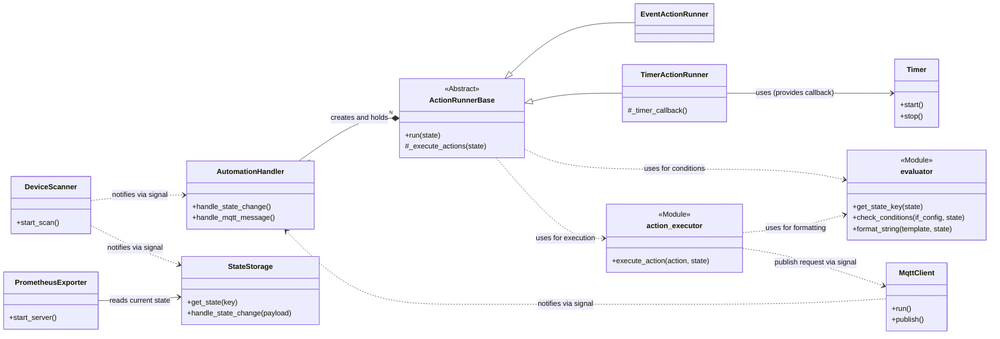

# Project Specification: switchbot-actions

## 1. Overview

This document outlines the design for `switchbot-actions`, a Python application designed to monitor SwitchBot Bluetooth Low Energy (BLE) devices and other event sources. The project has two primary goals:

1.  **Prometheus Exporter**: To expose sensor and state data from SwitchBot devices as metrics that can be scraped by a Prometheus server.
2.  **Automation Engine**: To provide a unified mechanism for executing custom actions based on a flexible `if/then` rule structure defined in a single `automations` section.

## 2. Architecture

The application employs a decoupled, signal-based architecture. The `DeviceScanner` component is responsible for scanning advertisements. For each new advertisement, it emits a `state_changed` signal.

The `MqttClient` component connects to an MQTT broker and listens for messages, emitting an `mqtt_message_received` signal for each message.

This signal is consumed by the `AutomationHandler`. The `AutomationHandler` acts as a central dispatcher. Upon initialization, it reads the `automations` from the configuration and, based on the `source` field of each rule, instantiates the appropriate `ActionRunner` subclass (e.g., `EventActionRunner` for `source: "switchbot"`, `TimerActionRunner` for `source: "switchbot_timer"`).

Each `ActionRunner` instance encapsulates the specific logic for its `source` type, including condition evaluation, cooldown management, and triggering action execution. `ActionRunnerBase` provides common interfaces and shared logic for all runners.

When an `ActionRunner` determines that actions should be executed, it delegates this responsibility to the `action_executor` module, which handles the actual execution of shell commands, webhooks, etc.

The core of the condition evaluation logic is encapsulated in the `evaluator` module. This module is responsible for interpreting the structure of state objects and evaluating conditions, making the system extensible to new types of event sources in the future.

### Mermaid Class Diagram


## 3. Components

### 3.1. `DeviceScanner`

  - **Responsibility**: Continuously scans for SwitchBot BLE advertisements and serves as the central publisher of device events.
  - **Functionality**: Emits a `state_changed` signal with the new state object as its payload.

### 3.2. `MqttClient`

  - **Responsibility**: Manages the connection to the MQTT broker, including automatic reconnection, and handles message publishing and subscribing.
  - **Functionality**: Emits an `mqtt_message_received` signal for incoming messages and provides a `publish` method for actions.

### 3.3. `StateStorage`

  - **Responsibility**: Acts as an in-memory cache for the latest known state of every observed entity. It is the single source of truth for the current state.
  - **Functionality**: Connects to the `state_changed` signal. Upon receiving a signal, it **immediately** updates its internal state for the relevant entity.

### 3.4. `PrometheusExporter`

  - **Responsibility**: Exposes device states as Prometheus metrics.
  - **Functionality**: Starts an HTTP server. When scraped, it fetches the latest data for all entities from the `StateStorage` and formats it into Prometheus metrics.

### 3.5. `evaluator` (Module)

  - **Responsibility**: Centralizes the logic for interpreting state objects and evaluating conditions.
  - **Functionality**:
    - `get_state_key(state)`: Extracts a unique key (e.g., MAC address or MQTT topic) from a state object.
    - `check_conditions(if_config, state)`: Determines if a state object meets the conditions defined in a rule's `if` block.

### 3.6. `action_executor` (Module)

  - **Responsibility**: Executes the actual actions (e.g., shell commands, webhooks) defined in the `then` block of an automation rule.
  - **Functionality**:
    - `format_string(template_string, state)`: Replaces placeholders in a string with actual state data.
    - `execute_action(action, state)`: Executes a single action based on its type (e.g., `shell_command`, `webhook`, `mqtt_publish`).

### 3.7. `AutomationHandler`

  - **Responsibility**: Acts as the central dispatcher for automation rules. It receives `state_changed` and `mqtt_message_received` signals and delegates processing to the appropriate `ActionRunner`.
  - **Functionality**: Initializes `ActionRunner` instances based on the `source` defined in automation configurations and calls their `run` method when a signal is received.

### 3.8. `ActionRunnerBase` (Abstract Class)

  - **Responsibility**: Defines the common interface and implements shared logic for all concrete `ActionRunner` implementations.
  - **Functionality**: Manages the automation rule's configuration, including cooldowns, and provides a common method (`_execute_actions`) for running the defined actions via `action_executor`.

### 3.9. `EventActionRunner`

  - **Responsibility**: Handles automation rules with `source: "switchbot"` or `source: "mqtt"` (event-driven triggers).
  - **Functionality**: Implements the `run` method to detect edge triggers (conditions becoming true) and executes actions accordingly.

### 3.10. `TimerActionRunner`

  - **Responsibility**: Handles automation rules with `source: "switchbot_timer"` or `source: "mqtt_timer"` (time-driven triggers).
  - **Functionality**: Implements the `run` method to manage internal timers and execute actions when conditions have been continuously met for a specified duration.

### 3.11. `Timer`

  - **Responsibility**: Manages a single timed automation.
  - **Functionality**: When started, it waits for a specified duration and then calls the `check_and_trigger` method on its associated handler.

## 4. Configuration (`config.yaml`)

The application is controlled by `config.yaml`. The `cooldown` and `duration` values should be specified in a format compatible with the **`pytimeparse2`** library (e.g., "10s", "5m", "1.5h").

### 4.1. `mqtt`

Configures the MQTT client connection.

  - `host`: (string, required) Hostname or IP address of the MQTT broker.
  - `port`: (integer, optional, default: 1883) Port number for the MQTT broker.
  - `username`: (string, optional) Username for authentication.
  - `password`: (string, optional) Password for authentication.
  - `reconnect_interval`: (integer, optional, default: 10) Interval in seconds to wait before attempting to reconnect.

### 4.2. `scanner`

Configures the BLE scanning behavior.

  - `cycle`: (integer, optional, default: 10) Time in seconds between the start of each scan cycle.
  - `duration`: (integer, optional, default: 3) Time in seconds the scanner will actively listen for BLE advertisements. This value must be less than or equal to `cycle`.
  - `interface`: (string, optional, default: "0") Bluetooth adapter number to use (e.g., "0" for hci0).

### 4.3. `automations`

This section defines a list of automation rules. Each rule is a map that follows a symmetric `if`/`then` structure.

  - **`name`**: (string) A unique, human-readable name for the automation.
  - **`cooldown`**: (string, optional) A duration (e.g., "5s", "10m") during which this automation will not be re-triggered after it fires. This is useful for preventing spam from rapid events. When a rule applies to multiple devices (e.g., by targeting a `modelName`), this cooldown is managed independently for each device.
  - **`if`**: (map, required) The "IF" block, defining the trigger source and conditions.
      - **`source`**: (string, required) The trigger source. Must be one of the following:
          - `"switchbot"`: Triggers **immediately** when the device's state changes to meet the conditions (edge-triggered).
          - `"switchbot_timer"`: Triggers when the device's state has been **continuously met** for a specified duration.
          - `"mqtt"`: Triggers **immediately** when an MQTT message is received that meets the conditions.
          - `"mqtt_timer"`: Triggers when an MQTT message's state has been **continuously met** for a specified duration.
      - **`duration`**: (string, required for `switchbot_timer` and `mqtt_timer`) The period the state must be continuously met for the trigger to fire.
      - **`device`**: (map, optional, for `switchbot` sources) Filters which devices this rule applies to based on attributes like `modelName` or `address`.
      - **`topic`**: (string, required for `mqtt` sources) The MQTT topic to subscribe to. Wildcards (`+`, `#`) are supported.
      - **`state`**: (map, optional) Defines the state conditions that must be met.
        - For `switchbot` sources, most keys (e.g., `temperature`, `isOn`) are evaluated against the key-value pairs within the nested `data` object of the advertisement. As a special case, the key `rssi` is evaluated against the top-level RSSI value. Conditions are simple comparisons (e.g., `temperature: "> 25.0"`).
        - For `mqtt` sources, the `payload` key evaluates the entire message payload. If the payload is a JSON object, you can also evaluate specific keys within the object (e.g., `temperature: "> 25.0"`).
  - **`then`**: (map, required) The "THEN" block, defining the action to be performed. It consists of a `type` (e.g., `shell_command`, `webhook`, `mqtt_publish`) and its corresponding parameters.
      - For `webhook` actions, you can optionally add a `headers` map to include custom HTTP headers in the request. Header values also support placeholders.
      - For `mqtt_publish` actions, you can specify `topic`, `payload`, `qos`, and `retain`.
        - The `payload` can be a `string` or a `dict` (map). If a `dict` is provided, it will be automatically converted to a JSON string. In this case, placeholders can be used within each value of the dictionary.

#### Example: Event-Driven Automation (`source: "switchbot"`)
```yaml
automations:
  - name: "High Temperature Alert"
    cooldown: "10m"
    if:
      source: "switchbot"
      device:
        modelName: "Meter"
      state:
        temperature: "> 28.0"
    then:
      type: "webhook"
      url: "https://example.com/alert"
      payload:
        message: "High temperature detected: {temperature}°C"
```

#### Example: Time-Driven Automation (`source: "switchbot_timer"`)
```yaml
automations:
  - name: "Alert if Door is Left Open"
    cooldown: "1h"
    if:
      source: "switchbot_timer"
      duration: "10m"
      device:
        modelName: "WoContact"
      state:
        contact_open: True
    then:
      type: "webhook"
      url: "https://example.com/alert"
      payload:
        message: "Warning: Door {address} has been open for 10 minutes!"
```

#### Example: MQTT-Driven Automation (`source: "mqtt"`)
```yaml
automations:
  - name: "Control Light via MQTT"
    if:
      source: "mqtt"
      topic: "home/living/light/set"
      state:
        payload: "ON"
    then:
      type: "mqtt_publish"
      topic: "home/living/light/status"
      payload: "ON"
      qos: 1
      retain: true
```

### 4.4. `prometheus_exporter`

Configures the Prometheus metrics endpoint.

  - `enabled`: (boolean, optional, default: `true`) Toggles the feature.
  - `port`: (integer, optional, default: 8000) The server port.
  - `target`: (dict, optional) Settings to filter the exported targets. **If this section is omitted, or if the `addresses`/`metrics` lists are empty, all discovered devices and all available metrics will be targeted, respectively.**
      - `addresses`: (list, optional) Only devices with a MAC address in this list will be targeted.
      - `metrics`: (list, optional) Only metrics with a name in this list will be exported.

### 4.5. `logging`

Configures the application's logging behavior.

  - `level`: (string, optional, default: "INFO") Default log level for the application. Valid values are "DEBUG", "INFO", "WARNING", "ERROR", "CRITICAL". This can be overridden by the `--debug` command-line flag.
  - `format`: (string, optional) Log format string, using Python's `logging` module syntax.
  - `loggers`: (map, optional) Allows setting specific log levels for individual loggers (e.g., for noisy libraries). These settings are ignored if the `--debug` flag is used.
    - Example: `bleak: "WARNING"` to suppress verbose BLE logs.
    - Example: `switchbot_actions.triggers: "DEBUG"` to enable detailed logs for trigger execution.


## 5. Project Structure

```
/switchbot-actions/
├── docs/
│   └── specification.md
├── switchbot_actions/
│   ├── main.py             # Application entry point
│   ├── signals.py          # Blinker signals
│   ├── scanner.py          # DeviceScanner
│   ├── mqtt.py             # MqttClient
│   ├── store.py            # StateStorage
│   ├── exporter.py         # PrometheusExporter
│   ├── handlers.py         # AutomationHandler
│   ├── action_runner.py    # ActionRunnerBase and concrete implementations
│   ├── action_executor.py  # Action execution logic
│   ├── timers.py           # Timer class and timer-related handlers
│   ├── evaluator.py        # Condition evaluation logic
│   └── __init__.py
├── tests/
├── config.yaml.example
└── README.md
```
