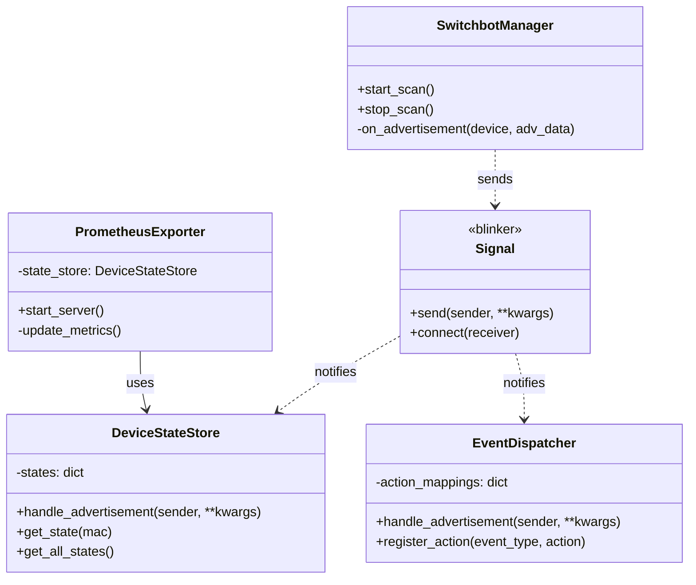

# Project Specification: switchbot-exporter

## 1. Overview

This document outlines the design for `switchbot-exporter`, a Python application designed to monitor SwitchBot Bluetooth Low Energy (BLE) devices. The project has two primary goals:

1.  **Prometheus Exporter**: To expose sensor and state data from SwitchBot devices as metrics that can be scraped by a Prometheus server.
2.  **Event-Driven Actions**: To provide a mechanism for executing custom actions (e.g., shell commands, webhooks) in near real-time when specific device events occur (e.g., a button is pressed, a sensor value crosses a threshold).

The application is designed to be a long-running service, managed entirely through a YAML configuration file, ensuring flexibility and ease of use without requiring code modification for new setups.

## 2. Architecture

The application employs a decoupled, event-driven architecture based on the **Hub & Spoke** model, facilitated by the `blinker` library's signal/slot mechanism. This approach avoids tight coupling between components, enhancing modularity and extensibility.

-   **Hub**: A central `SwitchbotManager` component is responsible for scanning for BLE advertisements and parsing the data. Upon receiving data, it emits a signal.
-   **Spokes**: Various listener components (`PrometheusExporter`, `EventDispatcher`) connect to the signal and react to the data independently.

This design ensures that the BLE scanning logic is centralized, preventing conflicts that could arise from multiple components trying to access the Bluetooth adapter simultaneously.

### Mermaid Class Diagram



## 3. Components

### 3.1. `SwitchbotManager`
-   **Responsibility**: The core of the application. It continuously scans for SwitchBot BLE advertisements using the `pyswitchbot` library.
-   **Functionality**:
    -   Initializes and manages the BLE scanning loop.
    -   Receives raw advertisement data.
    -   Uses `pyswitchbot`'s parsers to decode the raw data into a structured format.
    -   Emits an `advertisement_received` signal with the parsed data, making it available to the rest of the application.

### 3.2. `DeviceStateStore`
-   **Responsibility**: Acts as an in-memory cache for the latest known state of every observed device.
-   **Functionality**:
    -   Connects to the `advertisement_received` signal.
    -   On receiving data, it updates a dictionary, using the device's MAC address as the key.
    -   Provides methods for other components (like the `PrometheusExporter`) to retrieve the latest state of one or all devices.

### 3.3. `PrometheusExporter`
-   **Responsibility**: Exposes device states as Prometheus metrics.
-   **Functionality**:
    -   Starts a small HTTP server on a configurable port.
    -   When scraped, it fetches the latest data from the `DeviceStateStore`.
    -   Filters devices based on the `config.yaml` settings.
    -   Formats the data into Prometheus metrics (e.g., gauges for temperature, humidity, battery level).

### 3.4. `EventDispatcher`
-   **Responsibility**: Executes custom actions based on incoming device data and predefined rules.
-   **Functionality**:
    -   Connects to the `advertisement_received` signal.
    -   For each incoming event, it checks against a list of action rules defined in `config.yaml`.
    -   If an event's data matches the `event_conditions` of a rule, it executes the corresponding `trigger` (e.g., runs a shell command, sends a webhook).

## 4. Configuration (`config.yaml`)

All application behavior is controlled by `config.yaml`.

-   **`prometheus_exporter` section**:
    -   `enabled`: (boolean) Toggles the entire exporter feature.
    -   `port`: (integer) The port for the metrics server.
    -   `target`: (dict, optional) A dictionary to specify which devices and metrics to target.
        -   `addresses`: (list, optional) A list of device MAC addresses to export. If this key is missing or the list is empty, all discovered devices will be targeted.
        -   `metrics`: (list, optional) A list of metric names (e.g., "temperature", "humidity") to export. If this key is missing or the list is empty, all available metrics for the targeted devices will be exported.

-   **`actions` section**:
    -   A list of action rules. Each rule has:
        -   `name`: A descriptive name for the action.
        -   `event_conditions`: A dictionary of criteria that the incoming data must match. Supports operators (`>`, `<`, `==`, etc.) for numeric values.
        -   `trigger`: The action to perform, defined by a `type` (e.g., `shell_command`, `webhook`) and its required parameters.

## 5. Project Structure

```
/switchbot-exporter/
├── .git/
├── docs/
│   └── specification.md
├── switchbot_exporter/
│   ├── __init__.py
│   ├── main.py             # Application entry point
│   ├── signals.py          # Blinker signals
│   ├── manager.py          # SwitchbotManager
│   ├── store.py            # DeviceStateStore
│   ├── exporter.py         # PrometheusExporter
│   └── dispatcher.py       # EventDispatcher
├── tests/
├── .gitignore
├── config.yaml.example
├── README.md
└── requirements.txt
```
