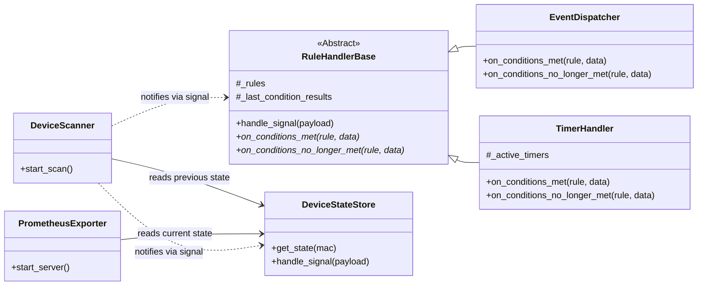

# Project Specification: switchbot-exporter

## 1. Overview

This document outlines the design for `switchbot-exporter`, a Python application designed to monitor SwitchBot Bluetooth Low Energy (BLE) devices. The project has two primary goals:

1.  **Prometheus Exporter**: To expose sensor and state data from SwitchBot devices as metrics that can be scraped by a Prometheus server.
2.  **Automation Engine**: To provide a mechanism for executing custom actions based on two distinct trigger types:
    * **Event-Driven Actions**: Execute actions immediately when a device's state changes.
    * **Time-Driven Timers**: Execute actions when a device remains in a specific state for a continuous duration.

The application is designed to be a long-running service, managed entirely through a single YAML configuration file, ensuring flexibility and ease of use without requiring code modification for new setups.

## 2. Architecture

The application employs a decoupled, signal-based architecture. The `DeviceScanner` component is responsible for scanning advertisements. For each new advertisement, it emits a single, rich `advertisement_received` signal.

This signal is consumed by several independent components. To handle stateful rule processing, `EventDispatcher` and `TimerHandler` inherit from a common `RuleHandlerBase`. This base class contains the core logic for detecting state transitions (e.g., a condition changing from `False` to `True`), while the subclasses implement the specific actions to take upon those transitions. This design ensures that components are loosely coupled and that state-change detection logic is centralized and reusable.

### Mermaid Class Diagram


## 3. Components

### 3.1. `DeviceScanner`

  - **Responsibility**: Continuously scans for SwitchBot BLE advertisements and serves as the central publisher of device events.
  - **Functionality**: Emits an `advertisement_received` signal with the new advertisement data as its payload.

### 3.2. `DeviceStateStore`

  - **Responsibility**: Acts as an in-memory cache for the latest known state of every observed device. It is the single source of truth for the current state of devices.
  - **Functionality**: Connects to the `advertisement_received` signal. Upon receiving a signal, it **immediately** updates its internal state for the relevant device.

### 3.3. `PrometheusExporter`

  - **Responsibility**: Exposes device states as Prometheus metrics.
  - **Functionality**: Starts an HTTP server. When scraped, it fetches the latest data for all devices from the `DeviceStateStore` and formats it into Prometheus metrics.

### 3.4. `RuleHandlerBase` (Abstract)

  - **Responsibility**: Provides the core state-transition detection logic for all rule-based handlers.
  - **Functionality**: Connects to the `advertisement_received` signal. For each rule and each device, it stores the result of the last condition evaluation. It compares the current result with the last known result to detect a change. When a change occurs, it calls one of its abstract methods (`on_conditions_met` or `on_conditions_no_longer_met`), which must be implemented by subclasses.

### 3.5. `EventDispatcher`

  - **Responsibility**: Handles **event-driven** automation based on rules in the `actions` section of the configuration.
  - **Functionality**: Inherits from `RuleHandlerBase`. It implements `on_conditions_met` to trigger an action immediately when a condition state transitions from `False` to `True` (an edge trigger). This prevents actions from firing repeatedly if a state remains true.

### 3.6. `TimerHandler`

  - **Responsibility**: Handles **time-driven** automation.
  - **Functionality**: Inherits from `RuleHandlerBase`.
  - **Timer Start**: Implements `on_conditions_met` to create and start a new asynchronous timer task when a device's state transitions from `False` to `True`.
  - **Timer Cancellation**: Implements `on_conditions_no_longer_met` to cancel the running timer task if the conditions transition back from `True` to `False`.

## 4. Configuration (`config.yaml`)

The application is controlled by `config.yaml`. The `cooldown` and `duration` values should be specified in a format compatible with the **`pytimeparse2`** library (e.g., "10s", "5m", "1.5h").

### 4.1. `prometheus_exporter`

Configures the Prometheus metrics endpoint.

  - `enabled`: (boolean) Toggles the feature.
  - `port`: (integer) The server port.
  - `target`: (dict, optional) Settings to filter the exported targets. **If this section is omitted, or if the `addresses`/`metrics` lists are empty, all discovered devices and all available metrics will be targeted, respectively.**
      - `addresses`: (list, optional) Only devices with a MAC address in this list will be targeted.
      - `metrics`: (list, optional) Only metrics with a name in this list will be exported.

### 4.2. `actions` (Event-Driven Triggers)

This section defines a list of rules that trigger **only at the moment** a device's state changes to meet the conditions (edge-triggered). Each rule is a map that can contain the following keys:

  - **`name`**: (string) A unique, human-readable name for the action.
  - **`cooldown`**: (string, optional) A duration (e.g., "5s", "10m") during which this action will not be re-triggered after it fires. This is useful for preventing spam from rapid events. When a rule applies to multiple devices (e.g., by targeting a `modelName`), this cooldown is managed independently for each device.
  - **`conditions`**: (map, required) The "IF" part of the rule.
      - **`device`**: Filters which devices this rule applies to based on attributes like `modelName` or `address`.
      - **`state`**: Defines the state conditions that must be met. Most keys (e.g., `temperature`, `isOn`) are evaluated against the key-value pairs within the nested `data` object of the advertisement. As a special case, the key `rssi` is evaluated against the top-level RSSI value. Conditions are simple comparisons (e.g., `temperature: "> 25.0"`).
  - **`trigger`**: (map, required) The "THEN" part of the rule. It defines the action to be performed and consists of a `type` (e.g., `shell_command`, `webhook`) and its corresponding parameters.

```yaml
actions:
  - name: "A unique name for the action"
    cooldown: "5s" # Optional: Mutes this action for 5 seconds after it fires.
    conditions:
      # Conditions to identify the target device(s).
      device:
        modelName: "Bot"
      # Conditions based on the device's state.
      state:
        # Triggers when 'isOn' is True.
        isOn: True
        # Triggers when temperature is greater than 25.0.
        temperature: "> 25.0"
    # The action to perform.
    trigger:
      type: "shell_command" # or "webhook"
      command: "echo 'Action Triggered for {address}'"
```

### 4.3. `timers` (Time-Driven Triggers)

This section defines a list of "one-shot" rules that trigger when a device's state has been sustained for a specific duration. Once a timer fires, it will not be re-armed until the conditions have first become `False` and then `True` again.

**Note**: The state of timers is held in memory. If the application is restarted, all timer counts will be reset.

Each rule in the list is a map that can contain the following keys:

  - **`name`**: (string) A unique, human-readable name for the timer.
  - **`cooldown`**: (string, optional) An optional duration during which this timer will not be re-triggered after it fires. When a rule applies to multiple devices (e.g., by targeting a `modelName`), this cooldown is managed independently for each device.
  - **`conditions`**: (map, required) The "IF" part of the rule.
      - **`device`**: Filters which devices this rule applies to.
      - **`state`**: Defines the state that must be sustained. These conditions are evaluated against the **`data`** object within the advertisement data. It supports standard comparisons like `temperature: "> 25.0"` or `motion_detected: False`.
  - **`duration`**: (string, required) The period the state defined in `conditions` must be continuously met for the trigger to fire.
  - **`trigger`**: (map, required) The "THEN" part of the rule, defining the action to be performed.

```yaml
timers:
  - name: "A unique name for the timer"
    cooldown: "1h" # Optional: Mutes this timer for 1 hour after it fires.
    conditions:
      # Conditions to identify the target device(s).
      device:
        modelName: "WoPresence"
      # The state that must be sustained for the entire duration.
      state:
          motion_detected: False
      # The duration the state must be continuously met.
      duration: "5m" 
    # The action to perform.
    trigger:
      type: "shell_command"
      command: "echo 'No motion detected for 5 minutes at {address}!'"
```

## 5. Project Structure

```
/switchbot-exporter/
├── docs/
│   └── specification.md
├── switchbot_exporter/
│   ├── main.py             # Application entry point
│   ├── signals.py          # Blinker signals
│   ├── scanner.py          # DeviceScanner
│   ├── store.py            # DeviceStateStore
│   ├── exporter.py         # PrometheusExporter
│   ├── handlers.py         # RuleHandlerBase
│   ├── dispatcher.py       # EventDispatcher (handles 'actions')
│   └── timers.py           # TimerHandler (handles 'timers')
├── tests/
├── config.yaml.example
└── README.md
```