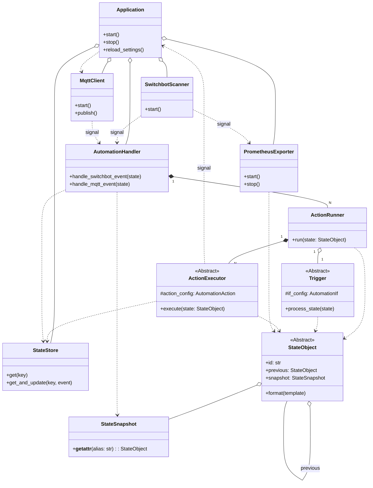

# **Project Specification: switchbot-actions**

## **1. Overview**

This document outlines the design for `switchbot-actions`, a Python application designed to monitor SwitchBot Bluetooth Low Energy (BLE) devices and other event sources, and execute custom actions based on a flexible rule engine.

The project has two primary goals:

1. **Automation Engine**: To provide a unified mechanism for executing custom actions based on a flexible `if`/`then` rule structure defined in a single configuration file.
2. **Prometheus Exporter**: To expose sensor and state data from SwitchBot devices as metrics that can be scraped by a Prometheus server.

## **2. Architecture**

The application employs a decoupled, signal-based architecture. `SwitchbotScanner` and `MqttClient` act as event sources, emitting signals for new device advertisements or messages.

These signals are consumed by the `AutomationHandler`, which acts as a central dispatcher. Upon receiving an event, the handler retrieves the previous state of the device from the `StateStore` and constructs a `StateSnapshot` of all current device states. These pieces of context are used to create a unified `StateObject`.

This `StateObject` is then passed to the appropriate `ActionRunner` instances. Each `ActionRunner` encapsulates a `Trigger` (which determines _if_ the rule's conditions are met) and a list of `ActionExecutors` (which determine _what_ to do). This design abstracts the trigger logic from the action execution, allowing for complex and reusable components.

#### **Class Diagram**



## **3. Quick Start Configuration**

For those who want to get started quickly, here is a minimal but practical `config.yaml` that demonstrates a key feature: inter-device automation.

This configuration will log a warning if the office temperature rises above 28属C **and** the office window is closed at the same time.

```yaml
# config.yaml

# Define aliases for your devices for easy reference.
devices:
  office-meter:
    address: "aa:bb:cc:dd:ee:ff" # Your temperature sensor's address
  office-window:
    address: "11:22:33:44:55:66" # Your contact sensor's address

# Define your automation rules.
automations:
  - name: "Turn on Fan when Hot and Window is Closed"
    if:
      # This rule triggers when the temperature sensor sends an update.
      source: "switchbot"
      device: "office-meter"
      conditions:
        # Condition 1: The sensor's temperature is above 28.0.
        temperature: "> 28.0"
        # Condition 2: At the same moment, check the state of the window sensor.
        office-window.contact_open: false
    then:
      # If both conditions are true, execute this action.
      type: "log"
      level: "WARNING"
      message: "Room is hot ({office-meter.temperature}属C) and window is closed. Consider turning on the fan."
```

## **4. Automation Engine Deep Dive**

This is the core of the application. The automation engine is configured under the `automations` and `devices` top-level keys in your `config.yaml`.

### **4.1. Core Concepts**

An automation rule consists of three main parts:

- **Rule**: A container for a single automation, which can have a `name` and a `cooldown`.
- **Trigger (`if` block)**: Defines **when** the rule should be activated. It specifies the event `source` and a set of `conditions` to be met.
- **Actions (`then` block)**: Defines **what** happens when the rule is triggered. It contains one or more actions to be executed.

### **4.2. Trigger Configuration (`if` block)**

The `if` block determines the precise circumstances under which an automation will run.

#### **4.2.1. Trigger Source (`source`)**

This mandatory key defines the type of event that can trigger the rule.

- `switchbot`: Triggers immediately when a SwitchBot device's state changes to meet the conditions (edge-triggered).
- `switchbot_timer`: Triggers only when a SwitchBot device's state has been **continuously** met for the specified `duration`.
- `mqtt`: Triggers immediately when an MQTT message is received that meets the conditions.
- `mqtt_timer`: Triggers only when the state derived from an MQTT message has been **continuously** met for the specified `duration`.

For `_timer` sources, the `duration` key is required (e.g., `"5m"`, `"30s"`).
For `mqtt` and `mqtt_timer` sources, the `topic` key is required.

#### **4.2.2. Conditions (`conditions`)**

The `conditions` map is where you define the specific state(s) required to trigger the rule.

##### **A. Basic Syntax**

A condition is a key-value pair: `attribute: 'operator value'`.

- **`attribute`**: The name of the state attribute to check (e.g., `temperature`).
- **`operator`**: (Optional) Can be `==`, `!=`, `>`, `<`, `>=`, `<=`. If omitted, `==` is assumed.
- **`value`**: The value to compare against.

Example: `temperature: '> 28.0'`

##### **B. Condition Targets: Whose State to Evaluate?**

You can evaluate conditions against three different contexts:

| **Target**            | **Key Syntax**       | **Description**                                                                                                   | **Example**                    |
| :-------------------- | :------------------- | :---------------------------------------------------------------------------------------------------------------- | :----------------------------- |
| **Triggering Device** | `attribute`          | The state of the device that initiated the event.                                                                 | `temperature: '> 25.0'`        |
| **Other Devices**     | `alias.attribute`    | The state of another device at the moment of the trigger. alias must be defined in the top-level devices section. | `living-room-ac.power: 'on'`   |
| **Previous State**    | `previous.attribute` | The state of the triggering device just before the current event.                                                 | `previous.contact_open: false` |

##### **C. Dynamic Comparisons with `previous`**

The `previous` context is powerful because it can be used on both sides of a condition, allowing you to detect state _changes_.

- **Left-Hand Side (LHS)**: Use `previous.attribute` as the key to check what the state _was_.
  - **Use Case**: Trigger when a door that _was closed_ is now open.
  - **Example**:

```yaml
conditions:
  previous.contact_open: false # The door was closed.
  contact_open: true # And now it is open.
```

- **Right-Hand Side (RHS)**: Use `{previous.attribute}` as a placeholder in the value to compare the current state against the previous one.
  - **Use Case**: Trigger on a button press by detecting if `button_count` has changed.
  - **Example**:

```yaml
conditions:
  # Triggers if the current count is not equal to the previous count.
  button_count: "!= {previous.button_count}"
```

##### **D. Handling Invalid References**

If a condition refers to an alias or attribute that does not exist (e.g., `non_existent_alias.temperature`), the condition is safely evaluated as `False`, and a `WARNING` is logged. The application will not crash.

### **4.3. Action Configuration (`then` block)**

The `then` block specifies one or more actions to execute when the `if` conditions are met. It can be a single action (a map) or a list of actions. All string parameters in actions support placeholders (e.g., `{temperature}`).

#### **Action Types**

- **`log`**: Logs a message to the application's console.
  - `message`: (string, required) The message to log.
  - `level`: (string, optional, default: `INFO`) Log level (`DEBUG`, `INFO`, `WARNING`, `ERROR`, `CRITICAL`).
- **`shell_command`**: Executes a shell command.
  - `command`: (string, required) The command to execute.
- **`webhook`**: Sends an HTTP request.
  - `url`: (string, required) The target URL.
  - `method`: (string, optional, default: `POST`) `POST` or `GET`.
  - `payload`: (map or string, optional) For `POST`, this is the JSON body. For `GET`, these are the URL query parameters.
  - `headers`: (map, optional) Custom HTTP headers.
- **`mqtt_publish`**: Publishes a message to an MQTT topic.
  - `topic`: (string, required) The target topic.
  - `payload`: (map or string, optional) The message payload. Maps are sent as JSON.
  - `qos`: (integer, optional, default: `0`) Quality of Service (`0`, `1`, or `2`).
  - `retain`: (boolean, optional, default: `false`) The retain flag.
- **`switchbot_command`**: Directly controls another SwitchBot device.
  - `device`: (string, optional) A reference to an alias in the `devices` section.
  - `address`: (string, optional) The MAC address of the target device. (Use `device` or `address`, not both).
  - `command`: (string, required) The command to execute (e.g., `turn_on`, `press`, `set_position`). Must match a method in the `pySwitchbot` library.
  - `params`: (map, optional) Arguments for the command method (e.g., `position`: `100`).
  - `config`: (map, optional) Constructor arguments for the device (e.g., `password`, `key_id`).

### **4.4. Device Definitions (`devices` block)**

This top-level section allows you to define reusable aliases for your devices. This is highly recommended as it makes your automations cleaner and easier to manage.

- **Key**: The alias name you will use in `if` and `then` blocks (e.g., `office-meter`).
- **`address`**: (string, required) The MAC address of the device.
- **`config`**: (map, optional) Device-specific constructor arguments for `pyswitchbot` (e.g., `password`, `encryption_key`).

An alias can be used in two places:

- `if.device`: Automatically adds the device's address to the conditions.
- `then.device`: Specifies the target for a `switchbot_command` action.

## **5. Component Configuration Reference**

This section covers the configuration for the application's other components.

### **5.1. **Configuration Precedence\*\*

Settings are loaded in the following order, with later sources overriding earlier ones:

1. **Application Defaults**: Hardcoded default values.
2. **config.yaml Settings**: Values loaded from your configuration file.
3. **Command-Line Flags**: Arguments passed at runtime (e.g., --debug, --scan-cycle).

### **5.2. `scanner`**

Configures the BLE scanning behavior.

- `cycle`: (integer, optional, default: `10`) Time in seconds between the start of each scan cycle.
- `duration`: (integer, optional, default: `3`) Time in seconds the scanner will actively listen. Must be less than or equal to `cycle`.
- `interface`: (integer, optional, default: `0`) Bluetooth adapter number (e.g., `0` for `hci0`).

### **5.3. `mqtt`**

Configures the MQTT client connection.

- `host`: (string, required) Hostname or IP of the MQTT broker.
- `port`: (integer, optional, default: `1883`)
- `username` / `password`: (string, optional)
- `reconnect_interval`: (float, optional, default: `10`) Seconds to wait before reconnecting.

### **5.4. `prometheus_exporter`**

Configures the Prometheus metrics endpoint.

- `enabled`: (boolean, optional, default: `false`)
- `port`: (integer, optional, default: `8000`)
- `target`: (map, optional)
  - `addresses`: (list, optional) List of MAC addresses to export. If empty, all are exported.
  - `metrics`: (list, optional) List of metric names (e.g., `temperature`) to export. If empty, all are exported.

### **5.5. `logging`**

Configures logging behavior.

- `level`: (string, optional, default: "`INFO`") (`DEBUG`, `INFO`, `WARNING`, `ERROR`, `CRITICAL`).
- `format`: (string, optional) Log format string.
- `loggers`: (map, optional) Set specific levels for libraries (e.g., `bleak`: "`WARNING`"). To troubleshoot why an automation rule isn't working, enable detailed logging for the automation engine by `setting switchbot_actions.automation: "DEBUG"`.

## **6. State Object & Placeholder Reference**

Placeholders allow you to insert dynamic data into your actions. They are resolved from the `StateObject` that triggered the rule.

| **Placeholder Syntax** | **Description**                                                    | **Example Value**                         |
| :--------------------- | :----------------------------------------------------------------- | :---------------------------------------- |
| `{attribute}`          | An attribute of the **triggering device**.                         | `{temperature}` -> `25.5`                 |
| `{previous.attribute}` | An attribute from the **previous state** of the triggering device. | `{previous.temperature}` -> `25.0`        |
| `{alias.attribute}`    | An attribute from **another device**, accessed via its alias.      | `{office-window.contact_open}` -> `false` |

**Commonly Available Attributes:**

- **All Devices**: `address`, `modelName`, `rssi`, `battery`.
- **Meter/Sensor**: `temperature`, `humidity`.
- **Contact Sensor**: `contact_open`, `is_light`, `motion_detected`, `button_count`.
- **Bot/Plug**: `isOn`.
- **Curtain**: `position`, `in_motion`.
- **MQTT**: `topic`, `payload`, and any keys from a JSON payload.

## **7. Developer Guide**

### **7.1. Internal Signals**

The application uses the `blinker` library for internal communication.

| **Signal Name**                    | **Emitter**        | **Role**                                        |
| :--------------------------------- | :----------------- | :---------------------------------------------- |
| `switchbot-advertisement-received` | `SwitchbotScanner` | Notifies of a new SwitchBot BLE advertisement.  |
| `mqtt-message-received`            | `MqttClient`       | Notifies of a new MQTT message.                 |
| `publish-mqtt-message-request`     | `ActionExecutor`   | Requests the `MqttClient` to publish a message. |

### **7.2. How to Add a New Trigger Source**

1. **Create a `StateObject` subclass** in `state.py`.
2. **Update the `create_state_object` factory** in `state.py` to handle the new event type.
3. **Create a new component** that emits a new signal with the raw event data.
4. **Update `AutomationHandler`** to subscribe to the new signal and dispatch it.
5. **Update `config.py`** to validate any new configuration parameters.
6. **Document** the new source and its `StateObject` structure here.

### **7.3. How to Add a New Action Type**

1. **Define a `pydantic` model** for the action in `config.py` and add it to the `AutomationAction` union type.
2. **Implement an `ActionExecutor` subclass** in `action_executor.py`.
3. **Update the `create_action_executor` factory** to instantiate your new executor.
4. **Document** the new action type and its parameters here.

## **8. Project Structure**

```
/switchbot-actions/
├── docs/
│   ├── deployment.md
│   └── specification.md
├── switchbot_actions/
│   ├── app.py              # Application main logic
│   ├── action_executor.py  # Action execution logic
│   ├── action_runner.py    # ActionRunnerBase and concrete implementations
│   ├── cli.py              # Command-line interface entry point
│   ├── config.py           # Pydantic models for configuration
│   ├── state.py            # StateObject class hierarchy for event data encapsulation
│   ├── exporter.py         # PrometheusExporter
│   ├── handlers.py         # AutomationHandler
│   ├── logging.py          # Logging setup
│   ├── mqtt.py             # MqttClient
│   ├── scanner.py          # SwitchbotScanner
│   ├── signals.py          # Blinker signals
│   ├── store.py            # StateStore
│   └── timers.py           # Timer class
├── tests/
├── config.yaml.example
└── README.md
```
