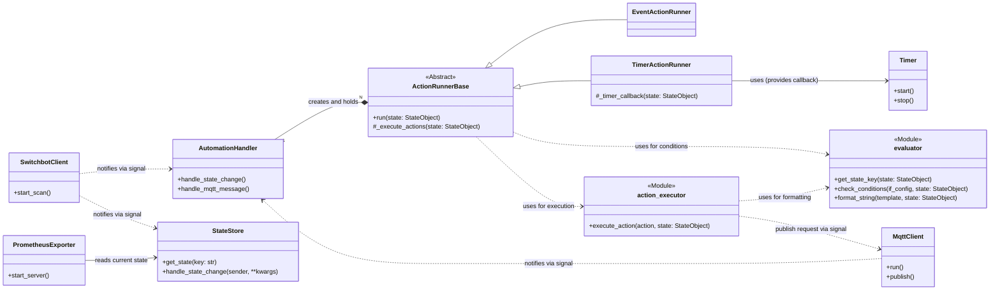

# Project Specification: switchbot-actions

## 1. Overview

This document outlines the design for `switchbot-actions`, a Python application designed to monitor SwitchBot Bluetooth Low Energy (BLE) devices and other event sources. The project has two primary goals:

1.  **Prometheus Exporter**: To expose sensor and state data from SwitchBot devices as metrics that can be scraped by a Prometheus server.
2.  **Automation Engine**: To provide a unified mechanism for executing custom actions based on a flexible `if/then` rule structure defined in the `automations` section of a configuration file.

## 2. Architecture

The application employs a decoupled, signal-based architecture. The `SwitchbotClient` component is responsible for scanning advertisements. For each new advertisement, it emits a `switchbot_advertisement_received` signal. The `MqttClient` component connects to an MQTT broker and listens for messages, emitting an `mqtt_message_received` signal for each message.

These signals are consumed by the `AutomationHandler`, which acts as a central dispatcher. Upon initialization, it reads the automation rules from the configuration and, based on the `source` field of each rule, instantiates the appropriate `ActionRunner` subclass (e.g., `EventActionRunner` or `TimerActionRunner`).

Each `ActionRunner` instance encapsulates the logic for its trigger type, including condition evaluation, cooldown management, and action execution. When an action is triggered, it delegates the execution to the `action_executor` module, which handles the specifics of running shell commands, webhooks, etc.

The core of the condition evaluation logic resides in the `evaluator` module. This module is responsible for interpreting the structure of state objects and evaluating conditions, making the system extensible to new event sources.

### Mermaid Class Diagram



## 3. Components

### 3.1. `SwitchbotClient`

  - **Responsibility**: Continuously scans for SwitchBot BLE advertisements and serves as the central publisher of device events.
  - **Functionality**: Emits a `switchbot_advertisement_received` signal with the new state object as its payload.

### 3.2. `MqttClient`

  - **Responsibility**: Manages the connection to the MQTT broker, including automatic reconnection, and handles message publishing and subscribing.
  - **Functionality**: Emits an `mqtt_message_received` signal for incoming messages and provides a `publish` method for actions.

### 3.3. `StateStore`

  - **Responsibility**: Acts as an in-memory cache for the latest known state of every observed entity. It is the single source of truth for the current state.
  - **Functionality**: Subscribes to the `switchbot_advertisement_received` signal and immediately updates its internal state upon receiving a new advertisement.

### 3.4. `PrometheusExporter`

  - **Responsibility**: Exposes device states from `StateStore` as Prometheus metrics.
  - **Functionality**: Starts an HTTP server. When scraped, it fetches the latest data for all entities and formats it into Prometheus metrics.

### 3.5. `evaluator` (Module)

  - **Responsibility**: Centralizes the logic for interpreting state objects and evaluating conditions.
  - **Functionality**:
      - `get_state_key(state)`: Extracts a unique key (e.g., MAC address or MQTT topic) from a state object.
      - `check_conditions(if_config, state)`: Determines if a state object meets the conditions defined in a rule's `if` block.
      - `format_string(template_string, state)`: Replaces placeholders in a string with actual state data.

### 3.6. `action_executor` (Module)

  - **Responsibility**: Executes the actions (e.g., shell commands, webhooks) defined in the `then` block of an automation rule.
  - **Functionality**: Executes a single action based on its `type` (`shell_command`, `webhook`, `mqtt_publish`).

### 3.7. `AutomationHandler`

  - **Responsibility**: Acts as the central dispatcher for automation rules. It receives signals and delegates processing to the appropriate `ActionRunner`.
  - **Functionality**: Initializes `ActionRunner` instances based on the automation configurations and calls their `run` method when a relevant signal is received.

### 3.8. `ActionRunnerBase` (Abstract Class)

  - **Responsibility**: Defines the common interface and implements shared logic (e.g., cooldowns) for all `ActionRunner` implementations.
  - **Functionality**: Manages an automation rule's configuration and provides a common `_execute_actions` method to run the defined actions via `action_executor`.

### 3.9. `EventActionRunner`

  - **Responsibility**: Handles event-driven triggers (`source: "switchbot"` or `"mqtt"`).
  - **Functionality**: Implements the `run` method to detect edge triggers (i.e., when conditions transition from false to true) and executes actions accordingly.

### 3.10. `TimerActionRunner`

  - **Responsibility**: Handles time-based triggers (`source: "switchbot_timer"` or `"mqtt_timer"`).
  - **Functionality**: Implements the `run` method to manage internal timers, executing actions only when conditions have been continuously met for a specified `duration`.

### 3.11. `Timer`

  - **Responsibility**: Provides a simple, cancellable timer for use by `TimerActionRunner`.
  - **Functionality**: When started, it waits for a specified duration and then executes a given callback function. It can be cancelled before completion.

## 4. Configuration Reference (`config.yaml`)

The application is controlled by `config.yaml`. Values for `cooldown` and `duration` should be specified in a format compatible with the **`pytimeparse2`** library (e.g., "10s", "5m", "1.5h").

### 4.1. `scanner`

Configures the BLE scanning behavior.

  - `cycle`: (integer, optional, default: 10) Time in seconds between the start of each scan cycle.
  - `duration`: (integer, optional, default: 3) Time in seconds the scanner will actively listen for BLE advertisements. Must be less than or equal to `cycle`.
  - `interface`: (integer, optional, default: 0) Bluetooth adapter number to use (e.g., `0` for `hci0`).

### 4.2. `mqtt`

Configures the MQTT client connection.

  - `host`: (string, required) Hostname or IP address of the MQTT broker.
  - `port`: (integer, optional, default: 1883) Port for the MQTT broker.
  - `username` / `password`: (string, optional) Credentials for authentication.
  - `reconnect_interval`: (integer, optional, default: 10) Seconds to wait before attempting to reconnect.

### 4.3. `automations`

A list of automation rules. Each rule is a map with the following structure:

  - **`name`**: (string, optional) A human-readable name for the automation.
  - **`cooldown`**: (string, optional) A duration (e.g., "5s") during which this automation will not be re-triggered for the same device after it has fired. Cooldowns are managed independently for each unique state key (e.g., per MAC address).
  - **`if`**: (map, required) Defines the trigger source and conditions.
      - **`source`**: (string, required) Must be one of:
          - `"switchbot"`: Triggers immediately when a device's state changes to meet the conditions (edge-triggered).
          - `"switchbot_timer"`: Triggers when a device's state has been continuously met for `duration`.
          - `"mqtt"`: Triggers immediately when an MQTT message is received that meets the conditions.
          - `"mqtt_timer"`: Triggers when an MQTT message's state has been continuously met for `duration`.
      - **`duration`**: (string, required for `_timer` sources) The period the state must be continuously met.
      - **`device`**: (map, optional, for `switchbot` sources) Filters devices based on attributes like `modelName` or `address`.
      - **`topic`**: (string, required for `mqtt` sources) The MQTT topic to subscribe to. Wildcards (`+`, `#`) are supported.
      - **`state`**: (map, optional) Defines the state conditions that must be met. Conditions are simple comparisons (e.g., `temperature: "> 25.0"`).
  - **`then`**: (list or map, required) Defines the action(s) to perform. Can be a single action (map) or a list of actions.
      - `type`: (string, required) The action type, e.g., `shell_command`, `webhook`, `mqtt_publish`.
      - Other parameters depend on the `type`. Values support placeholders (e.g., `{temperature}`, `{address}`). Refer to Section 5, "State Object Structure," for available placeholders.

### 4.4. `prometheus_exporter`

Configures the Prometheus metrics endpoint.

  - `enabled`: (boolean, optional, default: `false`) Toggles the feature.
  - `port`: (integer, optional, default: 8000) The server port.
  - `target`: (map, optional) Settings to filter exported metrics.
      - `addresses`: (list, optional) A list of MAC addresses. If specified, only these devices will be exported.
      - `metrics`: (list, optional) A list of metric names (e.g., `temperature`, `rssi`). If specified, only these metrics will be exported.

### 4.5. `logging`

Configures the application's logging behavior.

  - `level`: (string, optional, default: "INFO") Default log level. Valid values are "DEBUG", "INFO", "WARNING", "ERROR", "CRITICAL".
  - `format`: (string, optional) Log format string, using Python's `logging` module syntax.
  - `loggers`: (map, optional) Allows setting specific log levels for individual loggers (e.g., `bleak: "WARNING"`). Ignored if the `--debug` flag is used.

## 5. State Object Structure

Automation rules operate on **State Objects**. These objects contain the event data that triggered a rule and are used for both evaluating `if` conditions and populating placeholders in `then` actions.

### 5.1. SwitchBot Device State (`source: "switchbot"`, `"switchbot_timer"`)

This object contains flattened data from a SwitchBot device's BLE advertisement.

  - **Available Keys for Conditions & Placeholders**:

      - `address` (string): The device's MAC address (e.g., `"e1:22:33:44:55:66"`).
      - `modelName` (string): The human-readable model name (e.g., `"WoSensorTH"`, `"WoHand"`).
      - `rssi` (int): The signal strength (e.g., `-50`).
      - Device-specific sensor values (e.g., `temperature`, `humidity`, `isOn`, `contact_open`).

  - **Example Data (Meter)**:

    ```json
    {
      "address": "e1:22:33:44:55:66",
      "modelName": "WoSensorTH",
      "rssi": -50,
      "temperature": 25.0,
      "humidity": 50,
      "battery": 100
    }
    ```

### 5.2. MQTT Message State (`source: "mqtt"`, `"mqtt_timer"`)

This object represents a received MQTT message.

  - **Available Keys for Conditions & Placeholders**:

      - `topic` (string): The topic the message was published to.
      - `payload` (string): The raw message payload.
      - If the payload is a valid JSON object, its keys are also available as top-level keys for easy access (e.g., `temperature`).

  - **Example Data (JSON Payload)**:

    ```json
    {
      "topic": "home/sensor1",
      "payload": "{\"temperature\": 28.5, \"humidity\": 55}",
      "temperature": 28.5,
      "humidity": 55
    }
    ```

## 6. Developer Guide

### 6.1. Internal Signals

The application uses the following signals for internal communication between components:

| `blinker` Signal Name          | Emitter Component   | Role & Description                                           |
| ------------------------------ | ------------------- | ------------------------------------------------------------ |
| `state-changed`                | `SwitchbotClient`     | Notifies that a new SwitchBot BLE advertisement was received.  |
| `mqtt-message-received`        | `MqttClient`        | Notifies that a new MQTT message was received.               |
| `publish-mqtt-message-request` | `action_executor`   | Requests the `MqttClient` to publish a message.              |

### 6.2. How to Add a New Trigger Source

To add a new source (e.g., a webhook listener):

1.  **Create a component** that monitors the source and emits a new, uniquely named signal with a structured "State Object" as its payload.
2.  **Update `AutomationHandler`** to subscribe to this new signal.
3.  **Create a new `ActionRunner` subclass** if the trigger logic (e.g., event-based vs. timer-based) differs from existing ones.
4.  **Update `AutomationHandler`** to instantiate your new `ActionRunner` when the corresponding `source` is found in `config.yaml`.
5.  **Update `config.py`** to validate the new `source` and any associated parameters.
6.  **Document** the new source, its State Object structure, and configuration options in this specification.

### 6.3. How to Add a New Action Type

1.  **Define a new `pydantic` model** for the action's configuration in `config.py` and add it to the `AutomationAction` union type.
2.  **Implement the execution logic** as a new `async def _execute_...` function in `action_executor.py`.
3.  **Add a new `elif` block** in `execute_action` to call your new function.
4.  **Document** the new action type and its parameters in this specification.

## 7. Project Structure

```
/switchbot-actions/
├── docs/
│   └── specification.md
├── switchbot_actions/
│   ├── app.py              # Application main logic
│   ├── action_executor.py  # Action execution logic
│   ├── action_runner.py    # ActionRunnerBase and concrete implementations
│   ├── cli.py              # Command-line interface entry point
│   ├── config.py           # Pydantic models for configuration
│   ├── evaluator.py        # Condition evaluation logic
│   ├── exporter.py         # PrometheusExporter
│   ├── handlers.py         # AutomationHandler
│   ├── logging.py          # Logging setup
│   ├── mqtt.py             # MqttClient
│   ├── scanner.py          # SwitchbotClient
│   ├── signals.py          # Blinker signals
│   ├── store.py            # StateStore
│   └── timers.py           # Timer class
├── tests/
├── config.yaml.example
└── README.md
```
