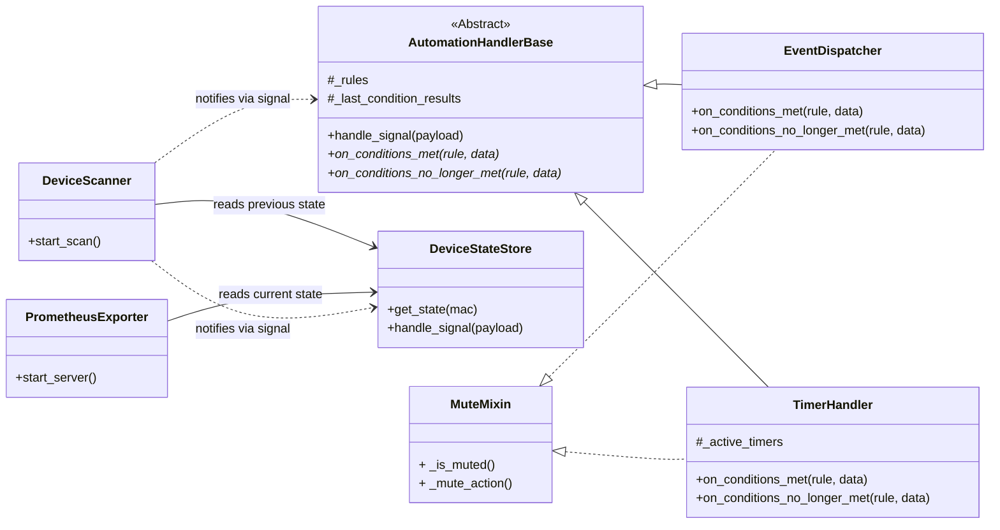

# Project Specification: switchbot-actions

## 1. Overview

This document outlines the design for `switchbot-actions`, a Python application designed to monitor SwitchBot Bluetooth Low Energy (BLE) devices. The project has two primary goals:

1.  **Prometheus Exporter**: To expose sensor and state data from SwitchBot devices as metrics that can be scraped by a Prometheus server.
2.  **Automation Engine**: To provide a unified mechanism for executing custom actions based on a flexible `if/then` rule structure defined in a single `automations` section.

The application is designed to be a long-running service, managed entirely through a single YAML configuration file, ensuring flexibility and ease of use without requiring code modification for new setups.

## 2. Architecture

The application employs a decoupled, signal-based architecture. The `DeviceScanner` component is responsible for scanning advertisements. For each new advertisement, it emits a single, rich `advertisement_received` signal.

This signal is consumed by several independent components. A main controller reads the `automations` from the configuration and, based on the `if.source` field of each rule, registers it with the appropriate handler:
-   `EventDispatcher`: For real-time state changes (`source: "switchbot"`).
-   `TimerHandler`: For sustained state conditions (`source: "switchbot_timer"`).

To handle stateful rule processing, `EventDispatcher` and `TimerHandler` inherit from a common `AutomationHandlerBase`. This base class contains the core logic for detecting state transitions (e.g., a condition changing from `False` to `True`), while the subclasses implement the specific actions to take upon those transitions. This design ensures that components are loosely coupled and that state-change detection logic is centralized and reusable.

### Mermaid Class Diagram


## 3. Components

### 3.1. `DeviceScanner`

  - **Responsibility**: Continuously scans for SwitchBot BLE advertisements and serves as the central publisher of device events.
  - **Functionality**: Emits an `advertisement_received` signal with the new advertisement data as its payload.

### 3.2. `DeviceStateStore`

  - **Responsibility**: Acts as an in-memory cache for the latest known state of every observed device. It is the single source of truth for the current state of devices.
  - **Functionality**: Connects to the `advertisement_received` signal. Upon receiving a signal, it **immediately** updates its internal state for the relevant device.

### 3.3. `PrometheusExporter`

  - **Responsibility**: Exposes device states as Prometheus metrics.
  - **Functionality**: Starts an HTTP server. When scraped, it fetches the latest data for all devices from the `DeviceStateStore` and formats it into Prometheus metrics.

### 3.4. `AutomationHandlerBase` (Abstract)

  - **Responsibility**: Provides the core state-transition detection logic for all rule-based handlers.
  - **Functionality**: Connects to the `advertisement_received` signal. For each rule and each device, it stores the result of the last condition evaluation. It compares the current result with the last known result to detect a change. When a change occurs, it calls one of its abstract methods (`on_conditions_met` or `on_conditions_no_longer_met`), which must be implemented by subclasses.

### 3.5. `EventDispatcher`

  - **Responsibility**: Handles automations where `if.source` is `switchbot`.
  - **Functionality**: Inherits from `AutomationHandlerBase`. It implements `on_conditions_met` to trigger an action immediately when a condition state transitions from `False` to `True` (an edge trigger). This prevents actions from firing repeatedly if a state remains true.

### 3.6. `TimerHandler`

  - **Responsibility**: Handles automations where `if.source` is `switchbot_timer`.
  - **Functionality**: Inherits from `AutomationHandlerBase`.
  - **Timer Start**: Implements `on_conditions_met` to create and start a new asynchronous timer task when a device's state transitions from `False` to `True`.
  - **Timer Cancellation**: Implements `on_conditions_no_longer_met` to cancel the running timer task if the conditions transition back from `True` to `False`.

## 4. Configuration (`config.yaml`)

The application is controlled by `config.yaml`. The `cooldown` and `duration` values should be specified in a format compatible with the **`pytimeparse2`** library (e.g., "10s", "5m", "1.5h").

### 4.1. `scanner`

Configures the BLE scanning behavior.

  - `cycle`: (integer, optional, default: 10) Time in seconds between the start of each scan cycle.
  - `duration`: (integer, optional, default: 3) Time in seconds the scanner will actively listen for BLE advertisements. This value must be less than or equal to `cycle`.
  - `interface`: (string, optional, default: "0") Bluetooth adapter number to use (e.g., "0" for hci0).

### 4.2. `automations`

This section defines a list of automation rules. Each rule is a map that follows a symmetric `if`/`then` structure.

  - **`name`**: (string) A unique, human-readable name for the automation.
  - **`cooldown`**: (string, optional) A duration (e.g., "5s", "10m") during which this automation will not be re-triggered after it fires. This is useful for preventing spam from rapid events. When a rule applies to multiple devices (e.g., by targeting a `modelName`), this cooldown is managed independently for each device.
  - **`if`**: (map, required) The "IF" block, defining the trigger source and conditions.
      - **`source`**: (string, required) The trigger source. Must be one of the following:
          - `"switchbot"`: Triggers **immediately** when the device's state changes to meet the conditions (edge-triggered).
          - `"switchbot_timer"`: Triggers when the device's state has been **continuously met** for a specified duration.
      - **`duration`**: (string, required for `switchbot_timer`) The period the state must be continuously met for the trigger to fire.
      - **`device`**: (map, optional) Filters which devices this rule applies to based on attributes like `modelName` or `address`.
      - **`state`**: (map, optional) Defines the state conditions that must be met. Most keys (e.g., `temperature`, `isOn`) are evaluated against the key-value pairs within the nested `data` object of the advertisement. As a special case, the key `rssi` is evaluated against the top-level RSSI value. Conditions are simple comparisons (e.g., `temperature: "> 25.0"`).
  - **`then`**: (map, required) The "THEN" block, defining the action to be performed. It consists of a `type` (e.g., `shell_command`, `webhook`) and its corresponding parameters.
      - For `webhook` actions, you can optionally add a `headers` map to include custom HTTP headers in the request. Header values also support placeholders.

#### Example: Event-Driven Automation (`source: "switchbot"`)
```yaml
automations:
  - name: "High Temperature Alert"
    cooldown: "10m"
    if:
      source: "switchbot"
      device:
        modelName: "Meter"
      state:
        temperature: "> 28.0"
    then:
      type: "webhook"
      url: "https://example.com/alert"
      payload:
        message: "High temperature detected: {temperature}°C"
```

#### Example: Time-Driven Automation (`source: "switchbot_timer"`)
```yaml
automations:
  - name: "Alert if Door is Left Open"
    cooldown: "1h"
    if:
      source: "switchbot_timer"
      duration: "10m"
      device:
        modelName: "WoContact"
      state:
        contact_open: True
    then:
      type: "webhook"
      url: "https://example.com/alert"
      payload:
        message: "Warning: Door {address} has been open for 10 minutes!"
```

### 4.3. `prometheus_exporter`

Configures the Prometheus metrics endpoint.

  - `enabled`: (boolean, optional, default: `true`) Toggles the feature.
  - `port`: (integer, optional, default: 8000) The server port.
  - `target`: (dict, optional) Settings to filter the exported targets. **If this section is omitted, or if the `addresses`/`metrics` lists are empty, all discovered devices and all available metrics will be targeted, respectively.**
      - `addresses`: (list, optional) Only devices with a MAC address in this list will be targeted.
      - `metrics`: (list, optional) Only metrics with a name in this list will be exported.

### 4.4. `logging`

Configures the application's logging behavior.

  - `level`: (string, optional, default: "INFO") Default log level for the application. Valid values are "DEBUG", "INFO", "WARNING", "ERROR", "CRITICAL". This can be overridden by the `--debug` command-line flag.
  - `format`: (string, optional) Log format string, using Python's `logging` module syntax.
  - `loggers`: (map, optional) Allows setting specific log levels for individual loggers (e.g., for noisy libraries). These settings are ignored if the `--debug` flag is used.
    - Example: `bleak: "WARNING"` to suppress verbose BLE logs.
    - Example: `switchbot_actions.triggers: "DEBUG"` to enable detailed logs for trigger execution.


## 5. Project Structure

```
/switchbot-actions/
├── docs/
│   └── specification.md
├── switchbot_actions/
│   ├── main.py             # Application entry point
│   ├── signals.py          # Blinker signals
│   ├── scanner.py          # DeviceScanner
│   ├── store.py            # DeviceStateStore
│   ├── exporter.py         # PrometheusExporter
│   ├── handlers.py         # AutomationHandlerBase
│   ├── dispatcher.py       # EventDispatcher (handles 'switchbot' source automations)
│   ├── timers.py           # TimerHandler (handles 'switchbot_timer' source automations)
│   ├── triggers.py         # Condition evaluation and action execution
│   └── mixins.py           # Muting/cooldown functionality
├── tests/
├── config.yaml.example
└── README.md
```
